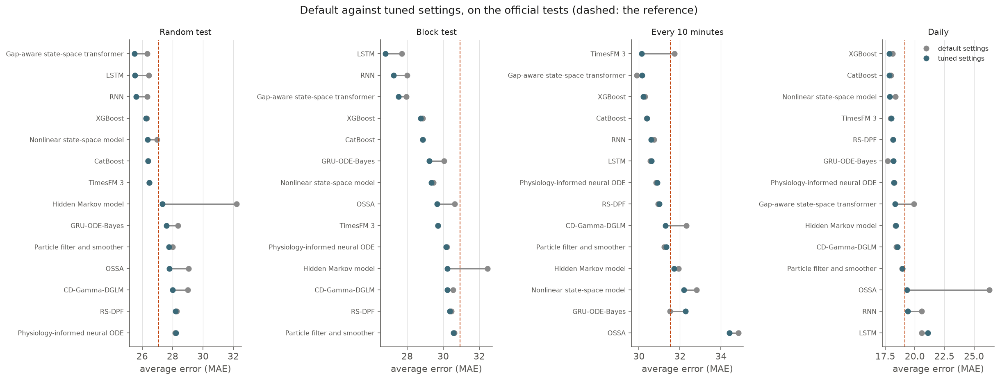
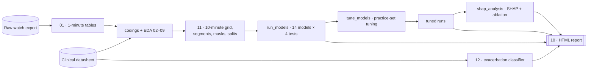
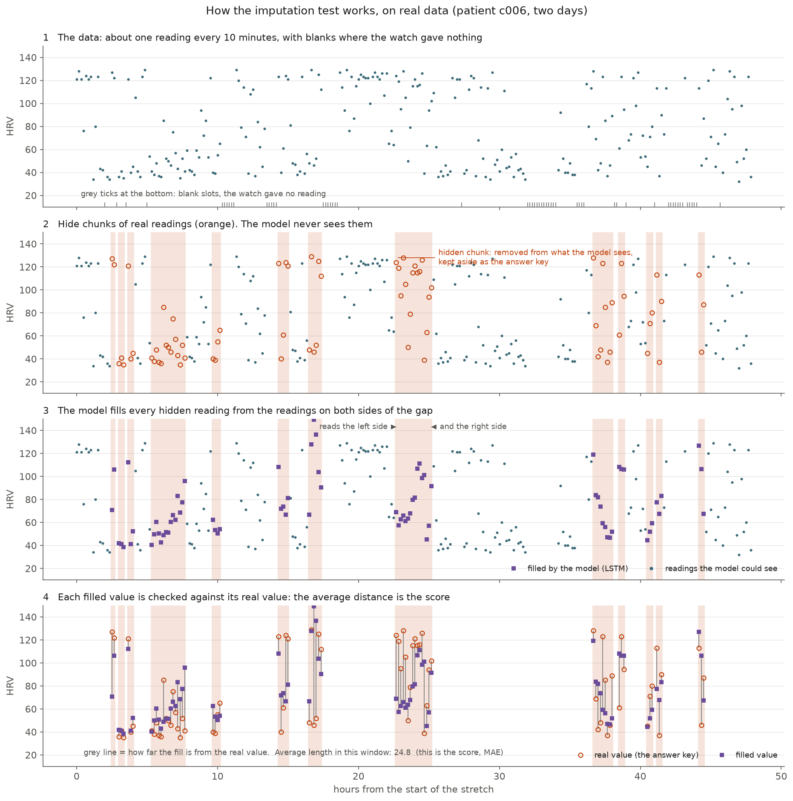
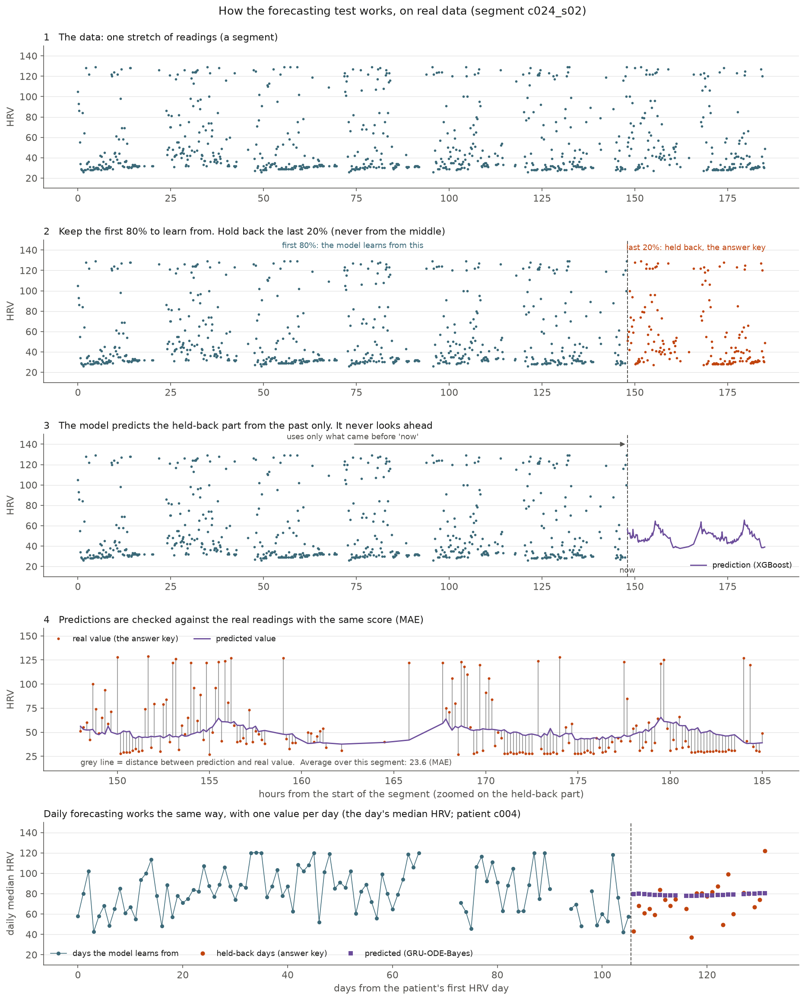
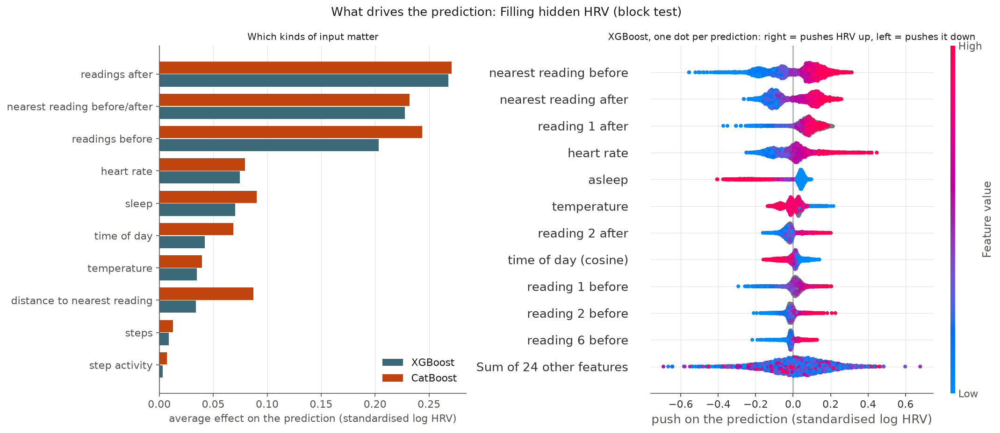
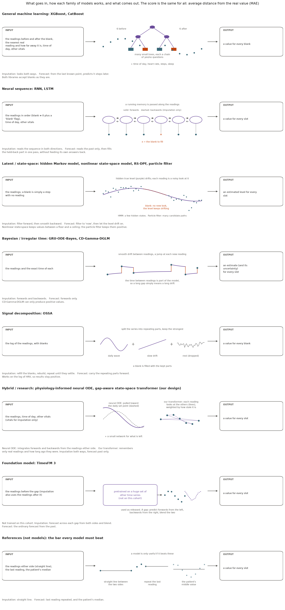

<div align="center">

# 🫁 COPD-HRV

### Imputing and forecasting smartwatch heart-rate variability in a COPD cohort

*14 models, one honest benchmark, every step reproducible from the raw export to the report.*

[](LICENSE)
[](https://www.python.org/)
[](https://pytorch.org/)
[](docs/MODELS.md)
[](docs/REPRODUCE.md)
[](docs/MODELS.md)
[](#-the-cohort)

[**Results**](#-results) · [**Pipeline**](#-pipeline) · [**Quick start**](#-quick-start) · [**Models**](#-models) ·
[**Reproducibility**](#-reproducibility) · [**Your own cohort**](#-your-own-cohort) · [**Cite**](#-citation) · [**Contact**](#-contributing-and-contact)

</div>

---

## 📌 Overview

Smartwatches record heart-rate variability (HRV) around the clock, but the record is full of holes: the watch comes off,
charges, or drops a bad reading. This repository asks two questions on a pilot COPD cohort, **in this order**:

1. **Imputation** — how well can a hidden stretch of HRV be filled back in from the readings around it?
2. **Forecasting** — how well can the next hours (or days) of HRV be predicted from the past alone?

and a third, from the clinical side: **can enrolment tests tell who will have an exacerbation?**

Fourteen methods, from gradient-boosted trees to particle filters, neural ODEs and a pretrained foundation model, are run
through the same data, the same hidden readings and the same scores, against simple references every model has to beat.

### ✨ Highlights

- 🧪 **One benchmark, no leaks.** The hidden readings are fixed in advance and identical for every model; tuning uses a separate
  practice set cut from the training data and never sees the official test.
- 📐 **Every model written out in maths** — as implemented, not as in the textbook — with every setting, its default and its
  tuning range ([docs/MODELS.md](docs/MODELS.md)).
- 🔁 **Reproducible end to end.** `./run_pipeline.sh` goes from the raw watch export to the report; two consecutive runs gave
  114 identical outputs, and GPU models reran to the last digit ([docs/REPRODUCE.md](docs/REPRODUCE.md)).
- 🔍 **Interpretable.** SHAP for the tree models, a drop-one-vital test for the neural ones, and diagrams that show each test
  and each model family step by step.
- 🏥 **Built to be reused.** Point it at another cohort's export: data location, patient IDs and file columns live in one place.

---

## 📊 Results

Average error (MAE, in the watch's HRV units; lower is better) on the official tests. Every number comes from
`numbers/model_results.csv` and `numbers/model_results_tuned.csv`.

| Test | Reference to beat | Best, default settings | Best, tuned settings |
|---|---|---|---|
| Fill hidden HRV — single readings | straight line **27.09** | XGBoost **26.30** | gap-aware transformer **25.50** |
| Fill hidden HRV — whole gaps | straight line **30.94** | LSTM **27.70** | LSTM **26.80** |
| Forecast — every 10 minutes | patient's median **31.52** | gap-aware transformer **29.88** | TimesFM 3 **30.12** |
| Forecast — daily | patient's median **19.16** | GRU-ODE-Bayes **17.69** | XGBoost **17.83** |

**Exacerbation from enrolment tests:** best AUC **0.68** (XGBoost, 37 patients, 12 with an exacerbation) — but shuffled
labels scored as high in 23 of 200 tries, so this is **not** evidence of a link.

<div align="center">

<br><sub><b>Default against tuned settings.</b> Grey: default; blue: tuned; dashed: the reference.</sub>
</div>

**What it means, briefly.** Filling whole gaps is where models clearly earn their keep (about 13% below the straight line).
Ten-minute forecasting barely beats the patient's own median, consistent with HRV's modest minute-to-minute memory.
Tuning helps the neural networks and the weaker models, and barely moves the trees. Heart rate is the vital that helps most.
Absolute errors remain large next to the signal (HRV here runs from 22 to 129): this is a pilot, not a clinical tool.

---

## 🧭 Pipeline



<table>
<tr>
<td width="50%"><br>
<sub><b>Imputation test.</b> Hide real readings, fill them from both sides, compare with the truth.</sub></td>
<td width="50%"><br>
<sub><b>Forecasting test.</b> Learn from the first 80%, predict the last 20% without looking ahead.</sub></td>
</tr>
</table>

---

## 🚀 Quick start

```bash
git clone https://github.com/jatindangi1206/copd.git && cd copd
python3.12 -m venv .venv && source .venv/bin/activate
pip install torch==2.13.0 --index-url https://download.pytorch.org/whl/cu130   # match your CUDA (CPU works too)
pip install -r requirements-lock.txt                                            # exact versions behind the results

# put the cohort's data under data/ (not included, see below), then:
./run_pipeline.sh                      # everything, raw export -> report
./run_pipeline.sh eda modeldata        # or only some stages
```

Single runs:

```bash
python run_models.py --list                                    # models, families, tasks
python run_models.py impute lstm --mask block                  # one model, one test
python run_models.py forecast xgboost --tuned                  # with its tuned settings
python run_models.py impute xgboost --mask block --params '{"K": 8, "lr": 0.1}'   # your own settings
python tune_models.py impute xgboost                           # tune one model
python shap_analysis.py all --tuned                            # what the models rely on
```

Modelling code never takes the whole machine: it shows the free cores and leaves two for the desktop (`--cores N` to set it).

---

## 🧠 Models

| Family | Model | Idea in one line | Built on |
|---|---|---|---|
| General machine learning | [XGBoost, CatBoost](docs/MODELS.md#61-gradient-boosted-trees-xgboost-catboost-modelsgbmpy) | many small trees on the neighbours, time of day and vitals | xgboost, catboost |
| Neural sequence | [RNN, LSTM](docs/MODELS.md#62-neural-sequence-rnn-lstm-modelsrnnpy-modelsseqpy) | a running memory read both ways (imputation) or past only (forecast) | PyTorch |
| Hybrid (our design) | [Gap-aware state-space transformer](docs/MODELS.md#63-gap-aware-state-space-transformer-our-design-modelsgastpy) | remembers only real readings and how stale they are, then attention | PyTorch |
| Latent / state-space | [Hidden Markov model](docs/MODELS.md#64-hidden-markov-model-modelshmmpy) | a few hidden states, a missing-aware forward–backward | hmmlearn |
| | [Nonlinear state-space](docs/MODELS.md#65-nonlinear-state-space-model-modelsnlssmpy) | drifting level + daily rhythm through a bounded sigmoid | filterpy (UKF + RTS) |
| | [Particle filter](docs/MODELS.md#66-particle-filter-and-smoother-modelspfpy) | log HRV pulled back to a daily rhythm, many candidate paths | particles |
| | [RS-DPF](docs/MODELS.md#67-rs-dpf-regime-switching-differentiable-particle-filter-modelsrsdpfpy) | regime-switching, differentiable particle filter | PyTorch |
| Bayesian / irregular time | [GRU-ODE-Bayes](docs/MODELS.md#68-gru-ode-bayes-modelsgrudepy-authors-code-in-modelsvendor) | continuous-time hidden state, a jump at each reading | authors' code (MIT) |
| | [CD-Gamma-DGLM](docs/MODELS.md#69-cd-gamma-dglm-modelsdglmpy) | Bayesian dynamic model with a Gamma reading, always positive | numpy, scipy |
| Signal decomposition | [OSSA](docs/MODELS.md#610-ossa-singular-spectrum-analysis-modelsossapy) | split into repeating parts, refill from the strongest | numpy |
| Hybrid / physiology | [Physiology-informed neural ODE](docs/MODELS.md#611-physiology-informed-neural-ode-modelspinodepy) | relaxes to a daily set point, plus a small network | torchdiffeq |
| Foundation model | [TimesFM 3](docs/MODELS.md#612-timesfm-3-modelstimesfm3py) | pretrained forecaster, used as released | timesfm (git-pinned) |

Every model implements the same two functions, so all are scored identically. The models were not picked at random:
ten characteristics of HRV were drawn from the literature and tested on the data; eight held, and only methods that respect
all eight were kept.

<details>
<summary><b>🔍 What the models rely on (SHAP and ablation)</b></summary>
<br>


To fill a gap, the trees lean on the readings just after and before it and the nearest real reading on each side; the other
vitals carry about a fifth of the weight. Removing all vitals and refitting raises the whole-gap error by 0.7 to 2.6, mostly
because of heart rate.
</details>

<details>
<summary><b>🗂️ Every model family, input → idea → output</b></summary>
<br>

</details>

---

## 🏥 The cohort

A pilot COPD cohort: **41 patients** with a clinical record at enrolment (symptoms, history, examination, imaging, spirometry,
oscillometry, six-minute walk, questionnaires, treatment), **40** with a smartwatch worn for weeks to months.
The watch gave **106,457 HRV readings** (SDNN, about one every 10 minutes, no unit given) from 28 patients, plus heart rate,
temperature, steps, SpO2 and sleep stages. **17 exacerbations** are dated, in 12 patients.

<details>
<summary><b>⚠️ Known problems in the datasheet (all handled in <code>codings.py</code>)</b></summary>
<br>

| Problem | Evidence |
|---|---|
| systolic and diastolic BP columns swapped | systolic < diastolic in 32 of 32 rows |
| one age recorded as 7 | 63 kg, 160 cm, BMI 24.6 (flagged; reports show it as recorded) |
| BODE does not match its own components | agrees in 4 of 18 rows; BODE vs walk distance r = +0.01 |
| a duration column mixes minutes and days | 8 of 28 entries are minutes |
| codes are not model-ready | Yes=1, No=2, None=0; ND / NK / NA mean missing, not categories |

</details>

---

## 🔁 Reproducibility

| What | How it was checked |
|---|---|
| 1-minute tables | `01_build_wearable.py --check`: 40 of 40 patients rebuilt identically from the raw export |
| data stages | `./run_pipeline.sh eda modeldata` twice: 114 outputs identical (tables, model data, 86 figures pixel by pixel) |
| GPU models | XGBoost and LSTM reran to the official MAE to every digit |
| provenance | every run records the git commit, `pip freeze` and a SHA-256 of every input file in `results/provenance/` |
| environment | `requirements-lock.txt`: the exact package versions behind the committed results |

Seeds are fixed throughout. A different GPU, driver or package version can move the last digits of GPU-trained models;
[docs/REPRODUCE.md](docs/REPRODUCE.md) says exactly what is and is not guaranteed, and how long each stage takes.

---

## 🧩 Your own cohort

Use one copy of the repository per cohort. Put the data under `data/`:

```
data/
  <export>/<pid>/<vital>/<pid>_<vital>.csv     watch export (heart rate, HRV, temperature, SpO2, sleep, steps)
  <datasheet>.xls                              clinical datasheet (Baseline and exacerbation sheets)
```

set the names in `common.py` (or `COHORT_DATA`, `COHORT_EXPORT`, `COHORT_SHEET`), and the export's columns at the top of
`01_build_wearable.py`. The step-by-step checklist, the datasheet columns the scripts expect, and the few settings that belong
to this watch (its HRV ceiling of 129, the 180-minute gap rule) are in [docs/REPRODUCE.md § 4](docs/REPRODUCE.md#4-another-cohort).

---

## 📁 Repository layout

```
run_pipeline.sh          the whole pipeline (provenance → wearable → eda → modeldata → models → classify → tune → tuned → explain → report)
common.py · codings.py   where the data is and what a patient ID looks like · the datasheet's coding and its repairs
01_build_wearable.py     raw export → 1-minute tables
02–09_*.py               exploration: cohort, data presence, HRV, gaps, distributions, sleep, datasheet profile
11_model_data.py         10-minute grid, segments, imputation masks, forecast splits (with self-checks)
run_models.py            one model on one test (--tuned, --params);  scripts/ runs every model
models/                  one file per model; models/data.py holds the shared inputs, scoring and saving
12_exac_classify.py      exacerbation classification (nested cross-validation, permutation test)
tune_models.py           tuning on a practice set (Optuna)
shap_analysis.py         SHAP, ablation
12_model_results.py · 13_method_figures.py · 10_report.py     tables, diagrams, the HTML report
docs/                    MODELS.md (maths) · REPRODUCE.md (setup, stages, new cohort) · HANDOFF.md (project history)
results.md               what each script found, script by script
```

---

## 🔒 Data availability

Patient-level data (the watch export, the datasheet, and everything derived from them) is **not** in this repository and
is excluded by `.gitignore`. The code, the documentation and aggregate figures are shared. For questions about the data,
contact the maintainer.

---

## 📝 Citation

If this code or benchmark helps your work, please cite it (GitHub's *Cite this repository* button uses
[`CITATION.cff`](CITATION.cff)):

```bibtex
@software{dangi_copd_hrv_2026,
  author  = {Dangi, Jatin},
  title   = {{COPD-HRV}: imputing and forecasting smartwatch heart-rate variability in a {COPD} cohort},
  year    = {2026},
  url     = {https://github.com/jatindangi1206/copd},
  license = {MIT}
}
```

---

## 🤝 Contributing and contact

Contributions, bug reports and questions are welcome.

- 🐛 **Found a bug or a wrong number?** Open an [issue](https://github.com/jatindangi1206/copd/issues) with the command you ran
  and the contents of `results/provenance/`.
- 💡 **Adding a model?** Implement `impute(series, ctx)` and `forecast(history, horizons, ctx)` in `models/`, register it in
  `models/__init__.py`, read its settings with `hp()`, add its maths and settings table to `docs/MODELS.md` and its search
  range to `tune_models.py`, and run `python run_models.py check`.
- 📧 **Anything else** — collaboration, data, or the project in general: **Jatin Dangi**, [jatin@ashoka.edu.in](mailto:jatin@ashoka.edu.in).

---

## 📄 License

Code released under the [MIT License](LICENSE) © 2026 Jatin Dangi.
Third-party parts keep their own terms: the vendored GRU-ODE-Bayes code is MIT (© 2019 Edward De Brouwer), and the
TimesFM 3 weights, downloaded on first use, are for non-commercial use only. Patient data is not covered.

## 🙏 Acknowledgements

Built on [XGBoost](https://github.com/dmlc/xgboost), [CatBoost](https://github.com/catboost/catboost),
[PyTorch](https://pytorch.org/), [hmmlearn](https://github.com/hmmlearn/hmmlearn), [filterpy](https://github.com/rlabbe/filterpy),
[particles](https://github.com/nchopin/particles), [torchdiffeq](https://github.com/rtqichen/torchdiffeq),
[GRU-ODE-Bayes](https://github.com/edebrouwer/gru_ode_bayes), [TimesFM](https://github.com/google-research/timesfm),
[Optuna](https://optuna.org/), [SHAP](https://github.com/shap/shap) and [scikit-learn](https://scikit-learn.org/).

<div align="center">
<sub>Made with care by <b>Jatin Dangi</b> · if this repository was useful, a ⭐ helps others find it.</sub>
</div>
